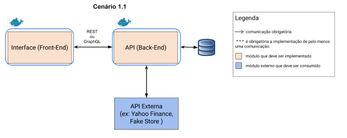

# Challenge Me 🧠✨

Um projeto desenvolvido em Angular que permite aos usuários explorar e aceitar desafios com base em diferentes tipos de atividades (como música, educação, lazer, etc). Os usuários podem iniciar, acompanhar o progresso e concluir os desafios — tudo isso com autenticação protegida via JWT.

---

## 🚀 Funcionalidades

- 🔐 Login e logout com autenticação JWT
- 🧩 Explorar desafios por categorias
- ✅ Aceitar desafios e vinculá-los ao usuário
- 🕐 Iniciar desafios e acompanhar progresso com barra de progresso
- 📈 Atualizar porcentagem de conclusão
- 🏁 Ver data de conclusão ao atingir 100%
- 🗑️ Excluir desafios concluídos
- 🔄 Menu que se adapta ao estado do usuário (logado ou não)

---

## 🚀 Modelo seguido



---

## 🐳 Rodando com Docker

### Pré-requisitos:

- Ter o **Docker** instalado e rodando.  
  Se ainda não tem, instale aqui: [https://www.docker.com/products/docker-desktop](https://www.docker.com/products/docker-desktop)

---

### 📦 Passo a passo para rodar o projeto:

1. **Clone o repositório:**

```bash
git clone https://github.com/seu-usuario/seu-repositorio.git
cd seu-repositorio
```

2. **Crie a build da aplicação Angular:**

```bash
npm install
ng build --prod
```

3. **Crie a imagem Docker:**

```bash
docker build -t challenge-me-frontend .
```

4. **Rode o container:**

```bash
docker run -d -p 4200:80 challenge-me-frontend
```

5. **Acesse no navegador:**

```
http://localhost:4200
```

---

## ⚙️ Estrutura Docker Utilizada

### `Dockerfile`:

```Dockerfile
# Etapa 1: build da aplicação
FROM node:18-alpine as builder
WORKDIR /app
COPY . .
RUN npm install
RUN npm run build --prod

# Etapa 2: nginx para servir a build
FROM nginx:stable-alpine
COPY --from=builder /app/dist/* /usr/share/nginx/html
EXPOSE 80
```

---

## 📚 Tecnologias Utilizadas

- Angular
- TypeScript
- Angular Material
- JWT Auth
- Laravel (backend)
- Docker

---

## 👤 Desenvolvido por

**Giovana Arisono Iwamizu**  

---